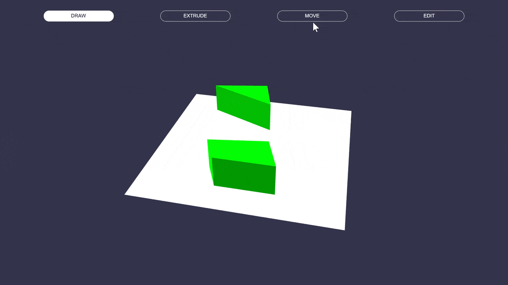
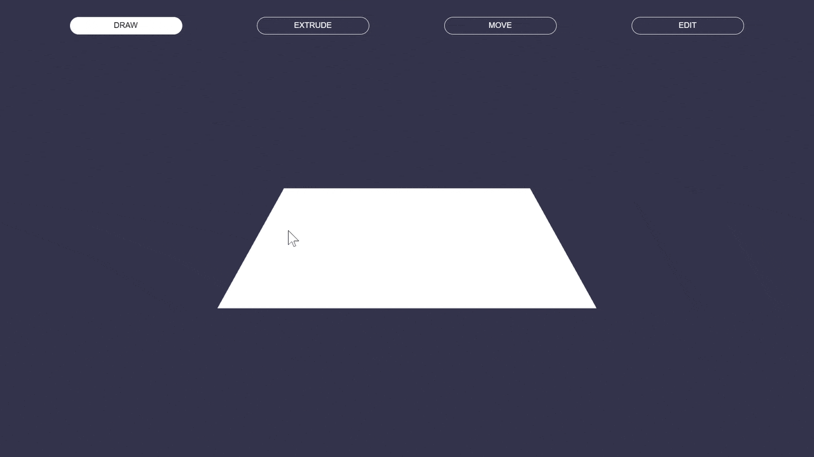

# Babylon Basic BIM

[](https://vitejs.dev/)
[](https://www.typescriptlang.org/)
[](https://www.babylonjs.com/)

Welcome to the Babylon Basic BIM project! This repository provides a basic setup to create and interact with 3D models using Babylon.js. Create shapes, extrude them, move them and edit their vertices.

**Play around with it:** <https://babylon-basic-bim.vercel.app/>



## Features

### Draw

Add points by clicking on the ground plane and right click to close the shape.


### Extrude

Click extrude to convert the 2d shape into 3d mesh.


### Move

Click on any mesh to select it and drag it along the ground plane.


### Edit

Click on the red spheres and drag it to modify its vertices.


## Getting Started

To get started with this project, you'll need to have Node.js and npm (or yarn) installed on your machine. If you haven't installed them yet, you can download and install them from Node.js official website.
Installation

Clone the repository and install the dependencies:

```bash
git clone <https://github.com/yourusername/babylon-basic-bim.git>
cd babylon-basic-bim
npm install
```

## Run it

### Start development server

```bash
npm run dev
```

### Build the application

```bash

npm run build
```

### Preview the production build

```bash

npm run preview
```

### Limitations

* Currently the vertex can be pulled into the opposite face of the polygon creating weird shapes.
* Initial setup uses a switch-case style code but switching to a more scene base approach will exponentially improve the code quality.
